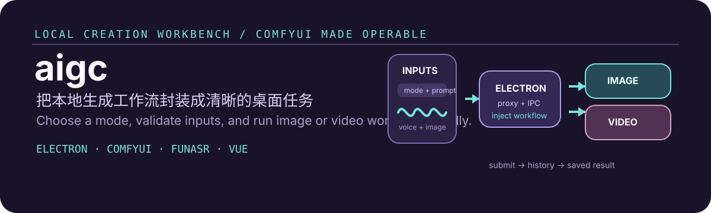

# aigc

  

  <strong>本地 ComfyUI 多模态生成工作台</strong> 
  Package local image and video workflows into clear desktop tasks with voice input.

## 这是什么 / What it is

aigc 是一个 Electron + Vue 桌面工作台，将 ComfyUI 节点工作流封装为更直接的图像、视频和换装任务。用户选择任务模式、输入提示词或语音、按需上传参考图，应用负责校验输入、注入工作流参数、提交任务并展示历史结果。

aigc keeps the model runtime local. It does not train or host the underlying models; it makes existing ComfyUI workflows easier to operate and diagnose.

## 支持的工作流 / Supported workflows

- 文生图 / Text to image
- 图生图 / Image to image
- 文生视频 / Text to video
- 图生视频 / Image to video
- 换装与相关参考图工作流 / Outfit-change and reference-image workflows
- 图片与视频 ComfyUI 服务独立配置
- 本地 FunASR SenseVoice 语音提示词输入

## 工作流 / How it works

1. 在应用中选择生成模式。
2. 输入提示词，或使用本地语音转写；需要时上传参考图。
3. 应用校验必需输入，并把提示词、图片、比例、帧率和随机种子注入工作流。
4. 开发环境通过 Vite 代理，桌面环境通过 Electron 主进程代理请求。
5. 应用轮询 ComfyUI History，展示完成结果和错误信息。

The proxy is intentional: direct browser requests to a local or LAN ComfyUI server can fail because of CORS or Origin restrictions.

## 快速开始 / Quick start

~~~powershell
npm install
npm run dev
~~~

常用命令：

~~~powershell
npm run build
npm run check:speech
npm run build:win
npm test
~~~

## ComfyUI 服务配置 / Configure ComfyUI targets

开发环境默认通过 /api/comfyui 访问图片服务。图片与视频可使用不同的 ComfyUI 服务地址：

~~~env
VITE_COMFYUI_SERVER=http://127.0.0.1:8188
VITE_COMFYUI_VIDEO_SERVER=http://127.0.0.1:8188
~~~

在应用左侧底部的 Settings 中，也可以为当前浏览器或 Electron profile 覆盖图片和视频服务地址。填写服务根地址，例如 http://192.168.0.131:8188，不要填写 /api/comfyui 路径。

Electron 会将配置后的绝对请求交给主进程转发，避免渲染进程因 ComfyUI 的 CORS 或 Origin 校验失败。

## 本地语音输入 / Local speech input

语音识别运行在 Electron 主进程，通过 ModelScope FunASR CLI 调用 SenseVoice。先确保 funasr 命令可用：

~~~powershell
pip install -U funasr
npm run check:speech
~~~

录音结束后，应用将临时 WAV 文件交给本地 CLI：

~~~text
funasr speech.wav --output-format json --model sensevoice --language zh
~~~

可通过环境变量调整本地 CLI、模型、语言和超时：

~~~env
FUNASR_CLI=funasr
FUNASR_MODEL=sensevoice
FUNASR_LANGUAGE=zh
FUNASR_TIMEOUT_MS=60000
~~~

Windows 建议使用 Python 3.10 或 3.11 安装 FunASR。Python 3.13 可能在 editdistance 依赖构建时失败；需要时使用独立环境，并将 FUNASR_CLI 指向其 funasr.exe。

## 验证与故障排查 / Verify and troubleshoot

~~~powershell
npm test
npm run build
npm run check:speech
~~~

连接失败时依次检查：

1. ComfyUI 服务是否正在运行。
2. 图片和视频目标地址是否填写为服务根地址。
3. 浏览器开发环境是否使用 /api/comfyui 代理路径。
4. Electron 环境是否允许主进程代理请求。
5. FunASR CLI 是否可在系统 PATH 或 FUNASR_CLI 指定位置运行。

详细语音说明见 docs/voice-recognition.md。
